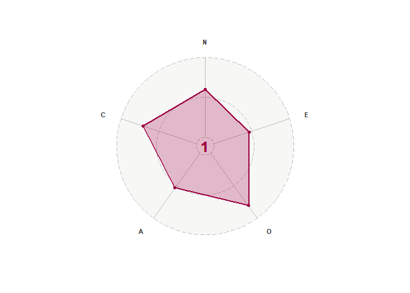
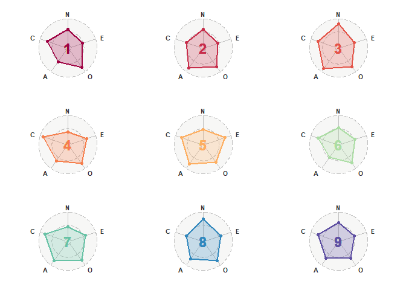
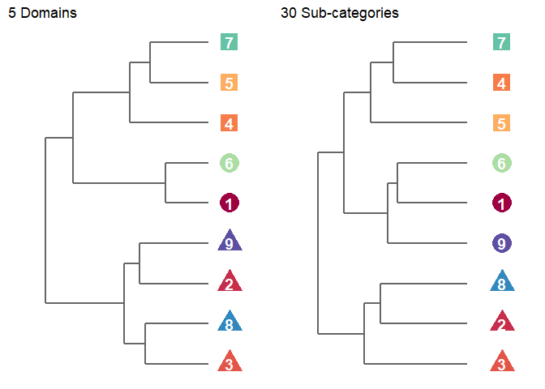
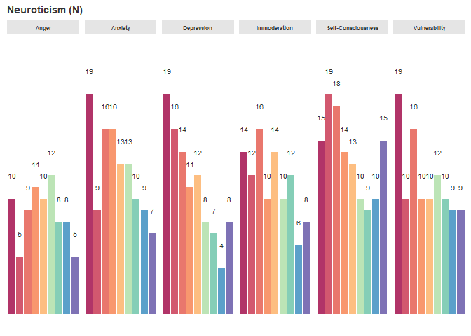
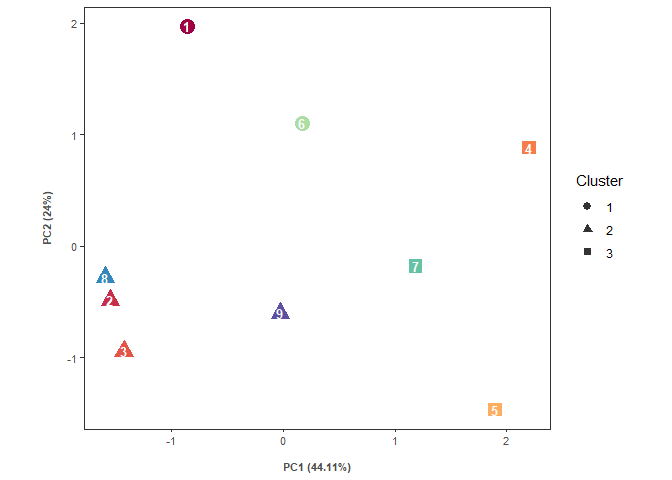
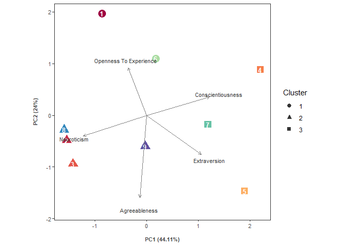
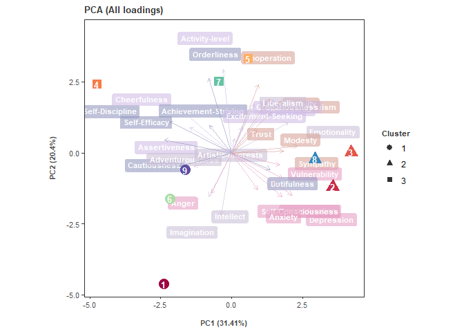
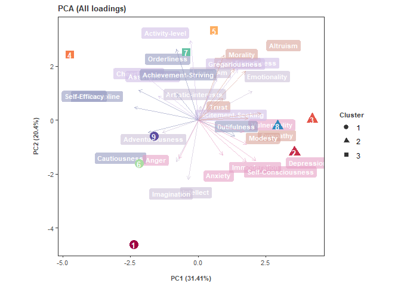

Big Five Analysis
================

This is an example showing how to generate various plots including radar
charts, dendrograms, bar plots and PCA using dummy data of the Big Five
Personality Test. The Big Five Personality Test is a free, open-source
test consisting of 120 simple questions. You can take the test through
this [link](https://bigfive-test.com/) and learn more about the test
there. Here is the original publication by [Johnson, J. A.
(2014)](https://doi.org/10.1016/j.jrp.2014.05.003).

## 1. Take a look at the `data`

The example data is available in `data.Rdata`. You can load the file
with `load()`.

``` r
load("data.Rdata")
```

It can also be loaded from the original google sheet with the
`googlesheets4` package. The code is available in
`1_load_googlesheet.R`.

``` r
library(googlesheets4)
data <- read_sheet("https://docs.google.com/spreadsheets/d/1ZE0DmZfJcgQ_K_1jsta_OAVmADc8z5F_aLhJlEk7CZU/edit#gid=0")
```

After the dummy data is loaded into the R environment, we can take a
look at it.

| Sample no. | Neuroticism | Extraversion | Openness To Experience | Agreeableness | Conscientiousness | Anxiety | Anger | Depression | Self-Consciousness | Immoderation | Vulnerability | Friendliness | Gregariousness | Assertiveness | Activity level | Excitement-Seeking | Cheerfulness | Imagination | Artistic interests | Emotionality | Adventurousness | Intellect | Liberalism | Trust | Morality | Altruism | Cooperation | Modesty | Sympathy | Self-Efficacy | Orderliness | Dutifulness | Achievement-Striving | Self-Discipline | Cautiousness |
|-----------:|------------:|-------------:|-----------------------:|--------------:|------------------:|--------:|------:|-----------:|-------------------:|-------------:|--------------:|-------------:|---------------:|--------------:|---------------:|-------------------:|-------------:|------------:|-------------------:|-------------:|----------------:|----------:|-----------:|------:|---------:|---------:|------------:|--------:|---------:|--------------:|------------:|------------:|---------------------:|----------------:|-------------:|
|          1 |          72 |           56 |                     97 |            64 |                85 |      13 |    10 |         12 |                 13 |           14 |            10 |            6 |              4 |            16 |              7 |                 11 |           12 |          20 |                 17 |           12 |              15 |        19 |         14 |    14 |        8 |       10 |           8 |      11 |       13 |            15 |           8 |          17 |                   15 |              12 |           18 |
|          2 |          71 |           56 |                     92 |            99 |                69 |       9 |     5 |         16 |                 19 |           12 |            10 |           11 |              5 |             5 |             11 |                 15 |            9 |          14 |                 15 |           17 |              13 |        18 |         15 |    14 |       19 |       17 |          15 |      17 |       17 |            12 |           5 |          17 |                   12 |               8 |           15 |
|          3 |          96 |           63 |                     92 |           102 |                84 |      19 |    10 |         19 |                 15 |           14 |            19 |           14 |              8 |            10 |             12 |                 14 |            5 |          13 |                 18 |           16 |              12 |        17 |         16 |    12 |       19 |       17 |          19 |      19 |       16 |             6 |          16 |          16 |                   20 |              11 |           15 |
|          4 |          46 |           78 |                     94 |            78 |               107 |       9 |     8 |          4 |                 10 |            6 |             9 |           11 |              4 |            15 |             14 |                 15 |           19 |          15 |                 19 |           11 |              17 |        16 |         16 |    12 |       16 |       12 |          17 |      10 |       11 |            19 |          20 |          14 |                   20 |              17 |           17 |
|          5 |          56 |           92 |                     87 |            95 |                91 |      10 |     8 |          7 |                  9 |           12 |            10 |           15 |             17 |            16 |             14 |                 14 |           16 |          13 |                 17 |           17 |              11 |        14 |         15 |    16 |       15 |       17 |          16 |      15 |       16 |            14 |          19 |          15 |                   15 |              12 |           16 |
|          6 |          65 |           66 |                     88 |            58 |                84 |      13 |    12 |          8 |                 10 |           10 |            12 |           11 |              6 |            11 |             11 |                 14 |           13 |          15 |                 17 |           14 |              11 |        16 |         15 |     9 |        5 |       10 |           8 |      13 |       13 |            16 |          12 |          13 |                   14 |              13 |           16 |
|          7 |          52 |           72 |                     93 |            97 |                97 |       7 |     5 |          8 |                 15 |            8 |             9 |           10 |              6 |            16 |             14 |                 11 |           15 |          16 |                 16 |           17 |              12 |        16 |         16 |    14 |       20 |       17 |          20 |      12 |       14 |            16 |          20 |          17 |                   15 |              13 |           16 |
|          8 |          89 |           71 |                     95 |            87 |                69 |      16 |     9 |         14 |                 18 |           16 |            16 |           14 |              7 |            14 |             10 |                 12 |           14 |          15 |                 20 |           16 |              13 |        14 |         17 |    15 |       15 |       14 |          16 |      11 |       16 |            10 |           9 |          16 |                   11 |              11 |           12 |
|          9 |          72 |           63 |                     83 |            83 |                86 |      16 |    11 |         11 |                 14 |           10 |            10 |            7 |              5 |            14 |             13 |                 11 |           13 |          11 |                 14 |           11 |              13 |        18 |         16 |    13 |       14 |       15 |          16 |      14 |       11 |            16 |          11 |          14 |                   15 |              14 |           16 |

The dataset contains 9 samples. The 5 columns after `Sample no.`
correspond to the 5 domains of the test:
[`Neuroticism`](https://bigfive-test.com/neuroticism),
[`Extraversion`](https://bigfive-test.com/extraversion),
[`Openness To Experience`](https://bigfive-test.com/openness_to_experience),
[`Agreeableness`](https://bigfive-test.com/agreeableness) and
[`Conscientiousness`](https://bigfive-test.com/conscientiousness).

Other columns are the 6 sub-categories under each domain. Detailed
descriptions of the domains and the sub-categories can be found in the
hyperlinks above.

## 2. Radar chart showing scores of each domain

You may wish to generate a radar chart with
[`ggradar`](https://github.com/ricardo-bion/ggradar). In this exercise,
the original code of `ggradar` has been modified. The modified codes are
available in the folder `ggradar_edit`.

With the function `gen_radar()`, a radar plot with the 5 big items is
generated. Below shows an example using sample no. 1. Aesthetics can be
changed in the source code `1_gen_radar.R`. For simplicity, the 5 items
are abbreviated with their initials. R script of this part is available
in `2_gen_radar.R`.

``` r
load("radar.Rdata")
radar_list_titleT[[1]]
```



Below shows the combined radar plots of all 9 samples. Each sample is
assigned with a specific color.

``` r
library(gridExtra)
grid.arrange(grobs = radar_list_titleT, nrow = 3, padding = unit(0, "line"))
```



Color of the samples were specified with the following codes extracted
from `2_gen_radar.R`:

``` r
library(RColorBrewer)
n_member <- nrow(data); n_red_range <- ceiling(n_member/2); n_blue_range <- n_member - n_red_range
# colors in yellow range are avoided for better visualization
colors <- c(colorRampPalette(colors = brewer.pal(11, 'Spectral')[1:4])(n_red_range),
            colorRampPalette(colors = brewer.pal(11, 'Spectral')[8:11])(n_blue_range))
```

## 3. Hierarchical clustering of samples

Using the `gen_dendro()` function, you can cluster the samples using the
5 domains or the sub-categories (argument `cat`); as well as the number
of groups (argument `clus_k`). The function generates a matrix of
Euclidean distances among samples with `dist()` function then performed
hierarchical clustering with `hclust()` using method “complete”. Chunk
of codes below is extracted from `3_gen_dendro.R` as demonstration:

``` r
# using sub-categories to cluster samples
cat <- data.frame(member_name, data[,-(1:6)])
dist_cat <- dist(cat[,-1], method = "euclidean")
hc_cat <- hclust(dist_cat, method = "complete")
cluster_cat <- cutree(hc_cat, k = clus_k)
```

Here are the resulting dendrograms generated using `ggdendrogram`
package for the domains and their sub-categories. `clus_k` were set to 3
in this example. The shape of the nodes corresponds to the group each
sample belongs. You may notice that there are slight differences in the
groupings.



## 4. Bar plots displaying scores of each sub-categories in the domains

With the `gen_bar()` function, bar-plots for each sub-categories of the
samples can be visualized for each domains. Bar plots are relatively
easy, just a few lines of codes available in `4_gen_bar.R`. Here just to
show one of the plots for the domain Neuroticism. Other plots are stored
in `bar.Rdata`. Please explore those plots if you are interested.



## 5. Principle Components Analysis (PCA)

PCA plots can be generated with the `gen_PCA()` function. The function
uses `prcomp()` to perform PCA using either scores of the domains or the
scores of the sub-categories, then generates plots combining the
grouping information from the hierarchical clustering by extracting the
information from the `prcomp` object. Codes below are extracted from
`5_gen_PCA.R` as demonstration:

``` r
load(dendrogram.Rdata)
cat_pca <- prcomp(cat_tbls[[n_cat]][,-1], scale=TRUE)
cluster <- data.frame(member = dendro_list[["cat2"]]$plot_env$ddata_cat$labels$label,
                      cluster = dendro_list[["cat2"]]$plot_env$cluster_cat) %>% arrange(member)
cat_pc_tbl <- data.frame(clusters[[n_cat]], as.data.frame(cat_pca$x)) # construct data.frame combining cluster information and Principle Component (PC) information stored in cat_pca$x
var <- cat_pca$sdev^2 / sum(cat_pca$sdev^2) # extract variance information of all PCs
```

You can set `LoadTF = TRUE` in the `gen_PCA()` function to show the
loadings in the plot. The loading points are arranged in descending
order of absolute magnitudes in PC1 and PC2 to indicate their relative
importance. You can choose the number of top loadings to show in the
plot by specifying the `n_load` argument. Code chunk below shows how
this part was performed `gen_PCA()`:

``` r
load_tbl <- data.frame(Variables = cat_name, cat_pca$rotation)
top_var <- load_tbl %>% select(Variables, PC1, PC2) %>% 
          mutate(hyp = sqrt(PC1^2+PC2^2)) %>% arrange(desc(hyp)) %>% .[1:n_load,]
```

These are the PCA plots for the 5 domains with and without displaying
the loadings.



Below are the PCA plots based on the sub-categories without displaying
loadings.


When `LoadTF = TRUE` and `n_load` is set at `10`. The plot looks like
this:



Each item is shaded according to their big 5 categories. Here is the
plot when all items are shown (`n_load` = 30).



You can play around with setting different `n_load` as well.

All the plots and objects created from the sample data are stored in
`.Rdata` files. Scripts in `.R` format used to generate the example
plots are available in this repo. Enjoy playing around with the data!
