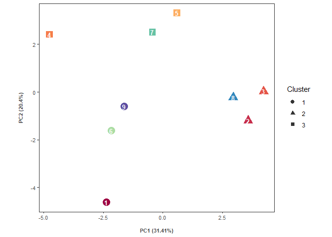

Big Five Analysis
================

This is an example showing how to generate various plots including radar
charts, dendrograms, bar plots and PCA using dummy data of the Big Five
Personality Test. The Big Five Personality Test is a free, open-source
test consisting of 120 simple questions. You can take the test through
this [link](https://bigfive-test.com/) and learn more about the test
there. Here is the original publication [Johnson, J. A.
(2014)](https://doi.org/10.1016/j.jrp.2014.05.003).

## 1. Take a look at the `data`

The example data is available in `data.Rdata`. You can load the file
with `load()`.

``` r
load("data.Rdata")
```

It can also be loaded from the original google sheet with the
`googlesheets4` package.

``` r
library(googlesheets4)
data <- read_sheet("https://docs.google.com/spreadsheets/d/1ZE0DmZfJcgQ_K_1jsta_OAVmADc8z5F_aLhJlEk7CZU/edit#gid=0")
```

After the dummy data is loaded into the R environment, we can have a
look on it.

| Sample no. | Neuroticism | Extraversion | Openness To Experience | Agreeableness | Conscientiousness | Anxiety | Anger | Depression | Self-Consciousness | Immoderation | Vulnerability | Friendliness | Gregariousness | Assertiveness | Activity level | Excitement-Seeking | Cheerfulness | Imagination | Artistic interests | Emotionality | Adventurousness | Intellect | Liberalism | Trust | Morality | Altruism | Cooperation | Modesty | Sympathy | Self-Efficacy | Orderliness | Dutifulness | Achievement-Striving | Self-Discipline | Cautiousness |
|-----------:|------------:|-------------:|-----------------------:|--------------:|------------------:|--------:|------:|-----------:|-------------------:|-------------:|--------------:|-------------:|---------------:|--------------:|---------------:|-------------------:|-------------:|------------:|-------------------:|-------------:|----------------:|----------:|-----------:|------:|---------:|---------:|------------:|--------:|---------:|--------------:|------------:|------------:|---------------------:|----------------:|-------------:|
|          1 |          72 |           56 |                     97 |            64 |                85 |      13 |    10 |         12 |                 13 |           14 |            10 |            6 |              4 |            16 |              7 |                 11 |           12 |          20 |                 17 |           12 |              15 |        19 |         14 |    14 |        8 |       10 |           8 |      11 |       13 |            15 |           8 |          17 |                   15 |              12 |           18 |
|          2 |          71 |           56 |                     92 |            99 |                69 |       9 |     5 |         16 |                 19 |           12 |            10 |           11 |              5 |             5 |             11 |                 15 |            9 |          14 |                 15 |           17 |              13 |        18 |         15 |    14 |       19 |       17 |          15 |      17 |       17 |            12 |           5 |          17 |                   12 |               8 |           15 |
|          3 |          96 |           63 |                     92 |           102 |                84 |      19 |    10 |         19 |                 15 |           14 |            19 |           14 |              8 |            10 |             12 |                 14 |            5 |          13 |                 18 |           16 |              12 |        17 |         16 |    12 |       19 |       17 |          19 |      19 |       16 |             6 |          16 |          16 |                   20 |              11 |           15 |
|          4 |          46 |           78 |                     94 |            78 |               107 |       9 |     8 |          4 |                 10 |            6 |             9 |           11 |              4 |            15 |             14 |                 15 |           19 |          15 |                 19 |           11 |              17 |        16 |         16 |    12 |       16 |       12 |          17 |      10 |       11 |            19 |          20 |          14 |                   20 |              17 |           17 |
|          5 |          56 |           92 |                     87 |            95 |                91 |      10 |     8 |          7 |                  9 |           12 |            10 |           15 |             17 |            16 |             14 |                 14 |           16 |          13 |                 17 |           17 |              11 |        14 |         15 |    16 |       15 |       17 |          16 |      15 |       16 |            14 |          19 |          15 |                   15 |              12 |           16 |
|          6 |          65 |           66 |                     88 |            58 |                84 |      13 |    12 |          8 |                 10 |           10 |            12 |           11 |              6 |            11 |             11 |                 14 |           13 |          15 |                 17 |           14 |              11 |        16 |         15 |     9 |        5 |       10 |           8 |      13 |       13 |            16 |          12 |          13 |                   14 |              13 |           16 |
|          7 |          52 |           72 |                     93 |            97 |                97 |       7 |     5 |          8 |                 15 |            8 |             9 |           10 |              6 |            16 |             14 |                 11 |           15 |          16 |                 16 |           17 |              12 |        16 |         16 |    14 |       20 |       17 |          20 |      12 |       14 |            16 |          20 |          17 |                   15 |              13 |           16 |
|          8 |          89 |           71 |                     95 |            87 |                69 |      16 |     9 |         14 |                 18 |           16 |            16 |           14 |              7 |            14 |             10 |                 12 |           14 |          15 |                 20 |           16 |              13 |        14 |         17 |    15 |       15 |       14 |          16 |      11 |       16 |            10 |           9 |          16 |                   11 |              11 |           12 |
|          9 |          72 |           63 |                     83 |            83 |                86 |      16 |    11 |         11 |                 14 |           10 |            10 |            7 |              5 |            14 |             13 |                 11 |           13 |          11 |                 14 |           11 |              13 |        18 |         16 |    13 |       14 |       15 |          16 |      14 |       11 |            16 |          11 |          14 |                   15 |              14 |           16 |

Each row corresponds to a sample. The 5 columns after `Sample no.`
correspond to the 5 big categories of the test: `Neuroticism`,
`Extraversion`, `Openness To Experience`, `Agreeableness` and
`Conscientiousness`.

The other columns are the 6 sub-categories under each of the 5 big
items.

## 2. Generate radar chart for each sample

You may wish to generate a radar chart with
[`ggradar`](https://github.com/ricardo-bion/ggradar). In this exercise,
the original code of `ggradar` has been modified. The modified codes are
available in the folder `ggradar_edit`.

With the function `gen_radar()`, a radar plot with the 5 big items is
generated. Below shows an example using sample no. 1. Aesthetics can be
changed in the source code `1_gen_radar.R`. For simplicity, the 5 items
are abbreviated with their initials.

``` r
load("radar.Rdata")
radar_list_titleT[[1]]
```

<!-- -->

Below shows the radar plots for all samples.

``` r
library(gridExtra)
grid.arrange(grobs = radar_list_titleT, nrow = 3, padding = unit(0, "line"))
```

<!-- -->

## 3. Cluster samples into groups

Using the `gen_dendro()` function, you can cluster the samples using the
5 big items or the sub-categories (`cat`); as well as the number of
groups (`clus_k`).

``` r
load("dendrogram.Rdata")
```

Here are the resulting dendrograms using the two sets of items. The
shape corresponds to the group each sample belongs. You may notice that
there are slight differences in the groupings.

<!-- -->

## 4. Bar plots

With the `gen_bar()` function , the bar-plots for each sub-categories of
the samples can be visualized.

``` r
load("bar.Rdata")
```

Here are the resulting dendrograms using the two sets of items.

    ## [[1]]

<!-- -->

    ## 
    ## [[2]]

<!-- -->

    ## 
    ## [[3]]

<!-- -->

    ## 
    ## [[4]]

<!-- -->

    ## 
    ## [[5]]

<!-- -->

## 5. PCA

PCA plots can be generated with the `gen_PCA()` function. By setting
`LoadTF = TRUE`, you can opt to show the loadings in the plot. `n_load`

``` r
load("PCA.Rdata")
```

These are the PCA for the big five items with and without showing
loadings of each item.

<!-- --><!-- -->

Below shows the PCA based on the sub-categories without loadings of the
items.

<!-- -->

When `LoadTF = TRUE` and `n_load` is set at `10`. The plot looks like
this:

<!-- -->

Each item is shaded according to their big 5 categories. Here is the
plor when all items are shown.

<!-- -->

All the `Rdata` and `.R` scripts to generate the example plots are
available in the folder.
